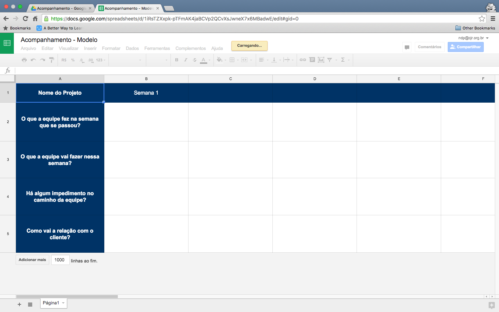
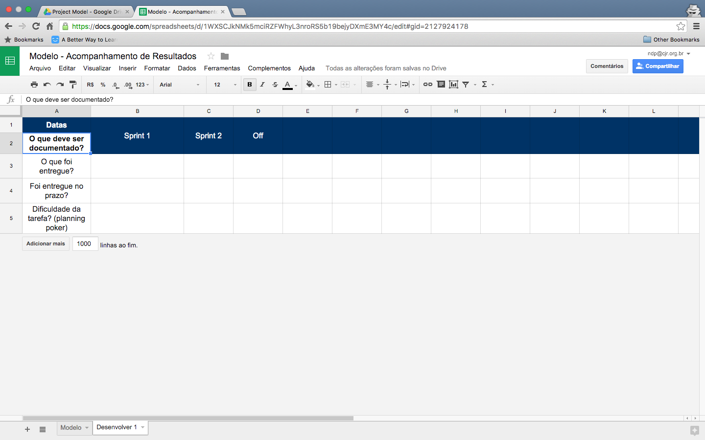
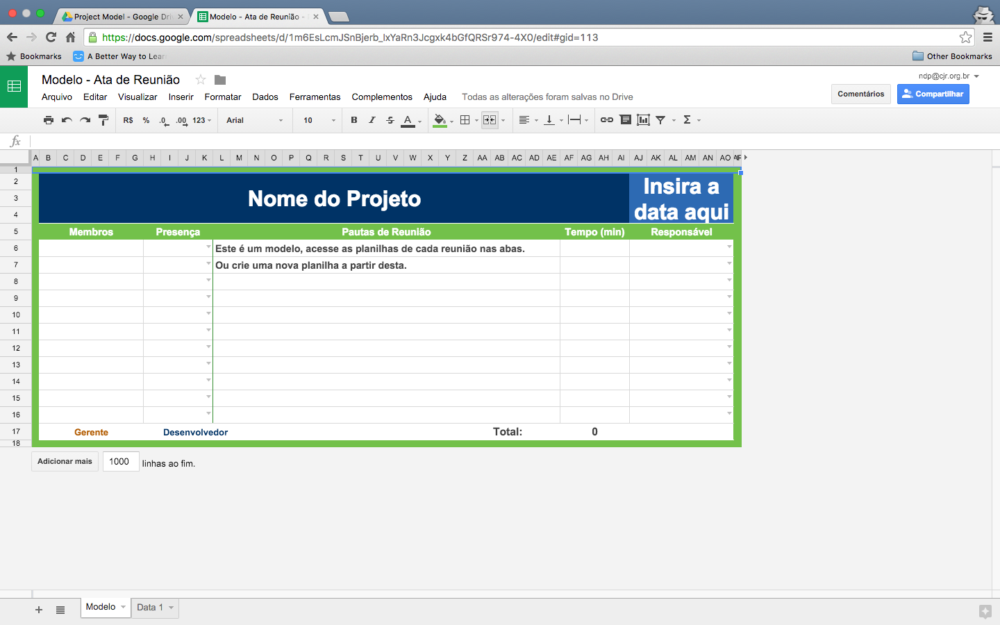
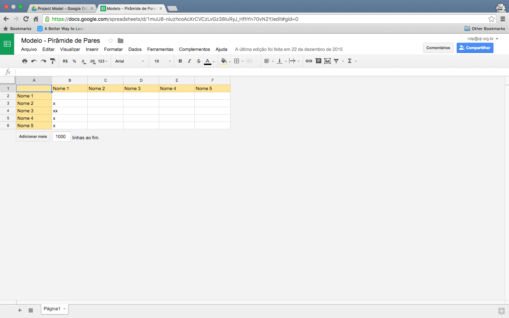

 Chapter 1: Gestão de Projetos
=============================

Nesse capítulo vamos falar as principais práticas de gestão que são utilizadas na CJR e como manté-las de forma prática.
A Gestão é importante pois não queremos cometer os mesmo erros que nossos ex-membros cometeram além de ter insumos para tomar melhores decisões quanto ao projeto e quanto ao nossos membros.

### Alocação de Projetos

**Revisar!**
A Alocação de projetos funciona da seguinte forma:
- Um negociador informa a NDP que um projeto vai ser fechado.
- O Líder da NDP seleciona um Scrum Master (vocês) que irá gerenciar o projeto.
- Caso o Scrum Master tenha uma equipe estudando ou fazendo um projeto com ele, essa equipe é convida a participar do projeto.
- Caso o Scrum Master não tenha uma equipe, a planilha de alocação de projetos é verificada e os membros são selecionados para o projeto
- *Assim a equipe é formada para o projeto*

### Acompanhamento do Líder da NDP

Para acompanhar o que está acontecendo no projeto, o Líder da NDP entra em contato com os Scrum Master **semanalmente**. Ele procura saber o que está acontecendo no projeto e utiliza os documentos do gerente para ver como está o andamento do projeto. *Por isso os documentos devem ser sempre preenchidos em dia para melhor desempenho do projeto*.
Além disso, o Líder tem uma planilha que possui quatro perguntas que são respondidas no acompanhamento semanal. Segue uma imagem do planilha:

### Documentos do Scrum Master

Os Scrum Master, para manter uma boa gestão, tem três documentos para acompanhar os resultados dos projetos.

##### Acompanhamento de Resultados

Nessa planilha devem documentados todos as entregas dos desenvolvedores, o nível de dificuldade que eles tiveram para relizar a determinada tarefa (na escala de Fibonacci) e se eles entregaram a atividade no prazo, adiantada ou atrasada.
Essa planilha devem ser preenchida em **todas** as reuniões (com a data da semana) ou, se aconteceu fora da reunião, colocar uma tag off e data da entrega.
A planilha é dividida em abas para cada desenvolver da equipe.
Segue uma imagem da planilha:

##### Ata de Reunião

A ata também é um documento que deve ser preenchido em **todas as reuniões** de projeto e deve documentar a prensença dos desenvolvedores além das pautas da reunião.
A planilha é dividida em abas para cada data que a reunião aconteceu.

##### Pirâmides de Pares

Esse documento visa documentar todas vezes que uma dupla de desenvolvedores fez programação em pares. Toda vez que uma dupla fizer, deve ser adicionado um "X" na interseção no nome da dupla.

