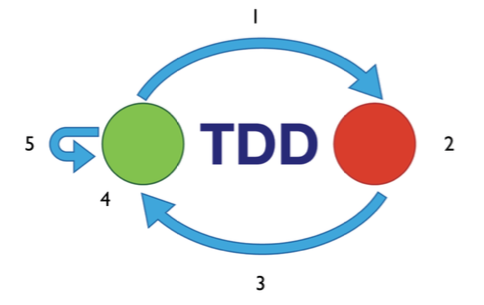
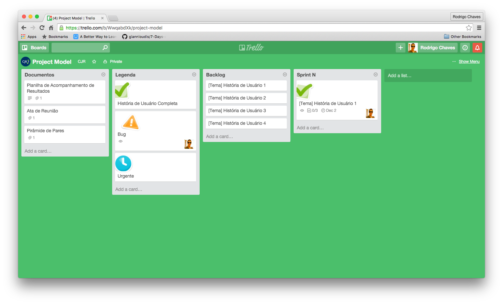
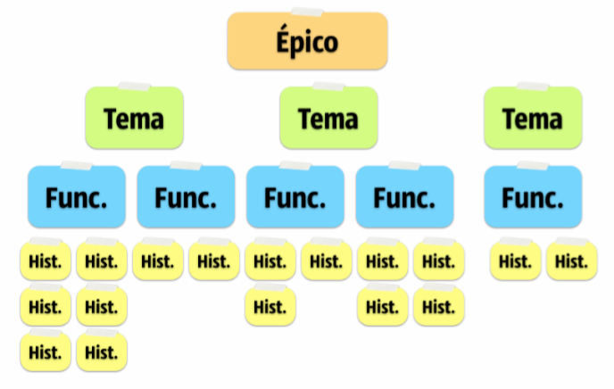

Desenvolvimento Ágil
====================

### O que é desenvolvimento ágil?

Desenvolvimento ágil é um novo modelo de desenvolvimento que procurar principalemnte gerar mais valor para o cliente atravez de uma comunicação mais eficiente do que um contrato fixo.
Esse modelo de desenvolvimento foi criado depois da frustação de vários desenvolvedores e gerentes com seus projeto a partir do manifesto ágil. Caso deseje ler mais sobre isso, acesse o [link](http://www.manifestoagil.com.br/).
Ao longo desse capítulo você poderá descobrir como o desenvolvimento funciona dentro da CJR.

### Good Programmming Practices

Primeiramente, vamos começar com o básico. Respondá o estudo dirigido `/chapter_2/exercise_2.md` para continuar sua jornada pelo conhecimento.

Agora você já está preparado, vamos ao que interessa.

Vamos começar pelo principios SOLID. Existem 5 principios que melhoram a qualidade das classes feitas pelos programadores.
Obs: a partir de agora, você encontrará o termo entidade de softwate, ou somente entidade, que significa um classe, módulo, função, etc

***Single Responsibility Principle***

**REVISAR!**
Robert C. Martin afirma que "uma classe deve ter um, e apenas um, motivo para mudar". Ou seja, Uma classe ou módulo deve ter apenas uma responsabilidade sobre uma funcionalidade do sistema e essa responsabilidade deve estar encapsulada dentro da classe. E ainda é imporantante que todos os serviços providos por ela sejam coerentes com o contexto da classe.

***Open Closed Principle***
Esse principio afirma "classes devem ser abertas à extensão, mas fechadas a alteração". Isso está muito relacionado com encapsulamente, onde não devemos nos preocupar com tal funcionalidade está implementada, porém devemos ser capazes de mudar seu funcionamento para algo ainda coerente no contexto daquela entidade conforme as entradas usadas.

***Liskov Substituition Principle***
O principio de Substituição de Barbara Liskov está intimamente ligado com as heranças, afirmando que uma classe S que herda T em uma aplicação qualquer, S sempre pode substituir T sem nenhuma perda de corretude ou performace.

***Interface Segregation Principle***
O principio de segregação de interfaces afirma que um cliente não precisa utilizar nenhuma funcionalidade interna de um módulo para que ele faça bom uso daquelas funcionalidades disponíveis pela interface.

***Dependency Inversion Principle***
"Dependa de Abstrações. Do not depend upon concretions" é a frase que resumo esse principio, que podemos quebrar em duas expressões:

+ Módulos de alto nível não devem depender de módulos de baixo nível. Ambos devem depender de abstrações
+ Abstrações não devem depender de detalhes. Detalhes devem depender de abstrações.

Concluindo, nossas classes não podem quebrar caso desejemos mudar as classes de baixo nível que funcionam com elas.

Além disso, existem outros principios que devem ser seguidos pelo Scrum Master afim de manter a qualidade de software ótima e ser um exemplo para seus desenvolvedores.

***"Nada de janelas quabradas"***

Quando um desenvolvedor deixa um código sem cobertura testes, por exemplo, o próximo desenvolvedor tem essa sensação que não houve zelo por aquele código, e cria um novo método, deixando-o sem testar também. Com o tempo será possível notar uma grande queda na cobertura de testes, tanto que talvez se torne muito difícil para a equipe reverter o cenário. O mesmo poderia valer para código deixado sem refatorar, ou qualquer outra má prática de desenvolvimento.
Mas o contrário também pode acontecer. Se boas práticas são feitas dentro do ambiente, todos os desenvolvedores criam maior resistência a manter essa práticas e a não quebrá-las.

### XP - eXtremming Programming

***Propriedade Coletiva do Código***

Todos os membros que participam do projeto tem responsabilidade pelo projeto. Não existe "essa funcionalidade não fui eu que implementei, então não tenho que entender". Isso exige que existe um alinhamento de todos os objetivos do projeto e permite maior manutenbilidade.

***Programação em Par***

Um programador pode levar horas para encontrar um problema se estiver trabalhando a muito tempo, cansado ou até mesmo não conhecer algum detalhe do objeto de estudo. Portanto, como é apenas um computador, o novato é que fica à frente fazendo a codificação, e o instrutor acompanha ajudando a desenvolver suas habilidades. Desta forma o programa sempre é revisto por duas pessoas, evitando e diminuindo assim a possibilidade de defeitos. Com isto busca-se sempre a evolução da equipe, melhorando a qualidade do código fonte gerado.

***Small Realeases***

A liberação de pequenas versões funcionais do projeto auxilia muito no processo de aceitação por parte do cliente, que já pode testar uma parte do sistema que está comprando. As versões chegam a ser ainda menores que as produzidas por outras metodologias incrementais.

***TDD***

TDD, ou Test Driven Development, é uma prática de XP que faz com que os desenvolvedores tenham que escrever teste antes mesmo de fazer o próprio código. Essa pratica de programação funciona com o seguinte fluxo:

+ 1) Adicione um teste rapidamente
+ 2) Execute todos os testes e observe o novo teste falhar
+ 3) Faça uma pequena mudança para fazer o teste passar
+ 4) Execute todos os teste e observe que foram bem sucedidos
+ 5) Refatore

As gemas que facilitam o processo de TDD em rails são:

+ [Rspec-rails](https://rubygems.org/gems/rspec-rails) -> para testes de unidade
+ [Capybara](https://rubygems.org/gems/capybara) -> para teste de integração

**Exercícios:**

> 1) O que é um teste de unidade?

Resposta:

> 2) O que é um teste de integração?

Resposta:

Caso deseje praticar TDD com Rails e conhecer as gemas que facilitam esse processo, faça esse [tutorial](http://tutorials.jumpstartlab.com/projects/contact_manager.html).

***Refatoração***

É um processo que permite a melhoria continua da programação, com o mínimo de introdução de erros e mantendo a compatibilidade com o código já existente. Refabricar melhora a clareza (leitura) do código, divide-o em módulos mais coesos e de maior reaproveitamento, evitando a duplicação de código-fonte.

### SCRUM

#### Modelo de Trello

O trello possui quatro listas importantes:

**Documentos:** um acesso rápido a todos os documentos que são importantes para o gerente.

**Legenda:** uma lista com o significado de cada sticker que pode ser usado no trello.

**Backlog:** É "uma lista contendo todas as funcionalidades desejadas para um produto. O conteúdo desta lista é definido pelo Product Owner. O Product Backlog não precisa estar completo no início de um projeto. Pode-se começar com tudo aquilo que é mais óbvio em um primeiro momento. Com o tempo, o Product Backlog cresce e muda à medida que se aprende mais sobre o produto e seus usuários."

**Sprint 'N':** é uma sprint numerada (1..). Aqui são listadas todas as histórias que foram levantas pela equipe para serem feitas durante a sprint. Cada sprint tem um tempo variável e tem objetivo de completas algumas histórias de usuário.

Cada história de Usuário completa deve ser marcada positivamente (existe um sticker para isso). Uma história de usuário completa é:

+ Código versionado no sistema de controle de versão.
+ Código refatorado.
+ Código dentro dos padrões de codificação.
+ *Código revisado ou feito em par.*
+ *Documentação de arquitetura atualizada.*
+ Testes de unidade realizados.
+ Testes de aceitação realizados.
+ *Testes exploratórios realizados.*
+ Nenhum defeito conhecido pendente.
+ PO aceitou na história.

#### Mapa de Histórias

O Mapa de histórias pode ser usado mensalmente em reuniões mensais um pouco mais longas onde a equipe precisa ter uma noção geral do que está feito e do que ainda precisa ser feito. Também é recomendado fazer o mapa no ínicio do projeto.

Como ainda não encontramos uma ferramenta muito boa para construir o mapa de histórias, recomenda-se usar uma cartolinha em branco e post-it's.

####  Hierárquia de Requisistos

Pode-se observar na imagem acima que histórias de usuário com o mesmo ator, ou tabela no banco de dados ou até mesmo um contexto parecido podem formar funcionalidades. Essas funcionalidades podem se tornar temas. E os temas criam um épico, que é o objetivo do sistema.

Exemplo:

Histórias:

+ Usuário cria um produto.
+ Usuário visualiza um produto.
+ Usuário atualiza um produto.
+ Usuário apaga um produto.
+ Usuário cria um categoria.
+ Usuário visualiza um categoria.
+ Usuário atualiza um categoria.
+ Usuário apaga um categoria.

Funcionalidades:

+ Usuário mantém produto
+ Usuário mantém categoria

Tema:

+ Vendas

Épico:
 
+ E-commerce de Mercado.

#### Modelo de Reunião.

Antes de mais nada, leia esses três tópicos:

+ [Sprint Planning Meeting](http://www.desenvolvimentoagil.com.br/scrum/sprint_planning_meeting)
+ [Sprint Retrospective](http://www.desenvolvimentoagil.com.br/scrum/sprint_retrospective)
+ [Sprint Review Meeting](http://www.desenvolvimentoagil.com.br/scrum/sprint_retrospective)

Essas três reuniões são infiáveis para a CJR. Porém seus conteúdos são muito importante e as reuniões semanais com a equipe devem ser sempre ter as seguintes pautas:

+ Quais histórias foram feitas na última semana?
+ Existe algum feedback para a equipe na última semana?
+ Quantos pontos foram feitos?
+ O que podemos fazer para melhorar nosso projeto?
+ O que podemos fazer para melhorar nosso desempenho?
+ Quais histórias deverão ser feitas na próxima semana?
+ Planning Poker do que queremos fazer.

#### Reunião diária

Encontros diários presenciais são um pouco complicados devido ao dia a dia de um membro da CJR, porém esses encontros podem ser simplemente resolvido com mensagens no Slack. Todos os dias úteis, de segunda à sexta, todos os membros devem responder às seguintes perguntas:

+ O que você fez ontem?
+ O que você fará hoje?
+ Há algum impedimento no seu caminho?

De preferência, os membros devem ter o costume de responder essas perguntas no mesmo horário. Sugestão: 10h00.
