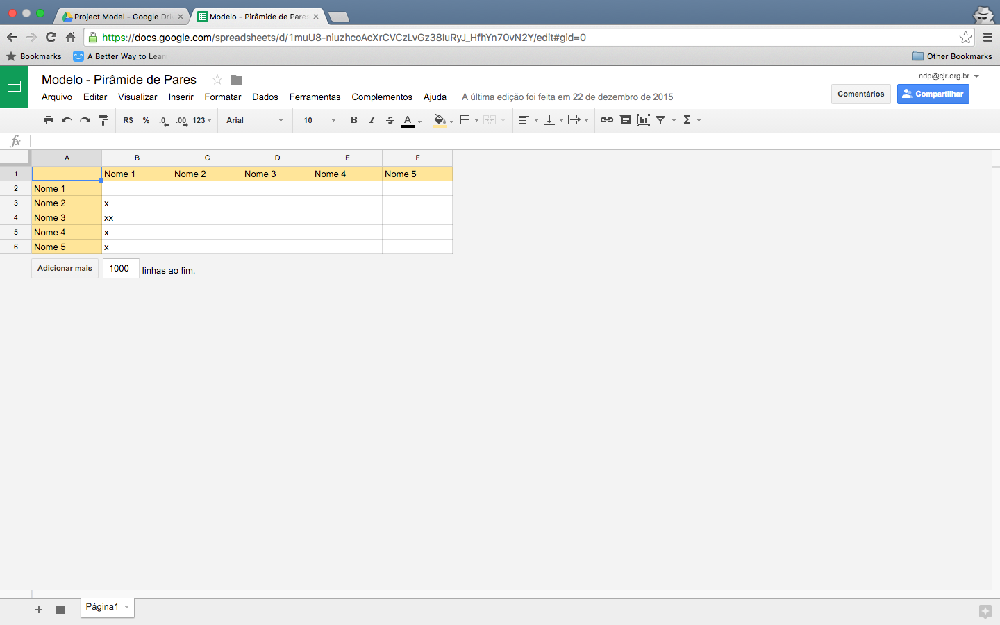

### Documentos do Scrum Master

Os Scrum Master, para manter uma boa gestão, tem três documentos para acompanhar os resultados dos projetos.

##### Acompanhamento de Resultados

Nessa planilha devem documentados todos as entregas dos desenvolvedores, o nível de dificuldade que eles tiveram para relizar a determinada tarefa (na escala de Fibonacci) e se eles entregaram a atividade no prazo, adiantada ou atrasada.
Essa planilha devem ser preenchida em **todas** as reuniões (com a data da semana) ou, se aconteceu fora da reunião, colocar uma tag off e data da entrega.
A planilha é dividida em abas para cada desenvolver da equipe.
Segue uma imagem da planilha:

##### Ata de Reunião

A ata também é um documento que deve ser preenchido em **todas as reuniões** de projeto e deve documentar a prensença dos desenvolvedores além das pautas da reunião.
A planilha é dividida em abas para cada data que a reunião aconteceu.

##### Pirâmides de Pares

Esse documento visa documentar todas vezes que uma dupla de desenvolvedores fez programação em pares. Toda vez que uma dupla fizer, deve ser adicionado um "X" na interseção no nome da dupla.

