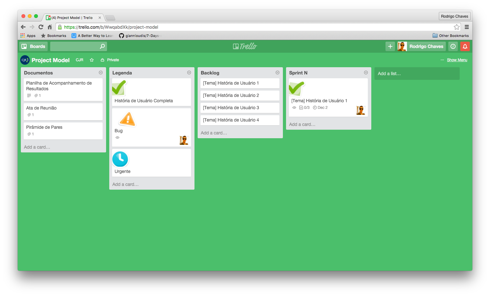

### SCRUM

#### Modelo de Trello

O trello possui quatro listas importantes:

**Documentos:** um acesso rápido a todos os documentos que são importantes para o gerente.

**Legenda:** uma lista com o significado de cada sticker que pode ser usado no trello.

**Backlog:** É "uma lista contendo todas as funcionalidades desejadas para um produto. O conteúdo desta lista é definido pelo Product Owner. O Product Backlog não precisa estar completo no início de um projeto. Pode-se começar com tudo aquilo que é mais óbvio em um primeiro momento. Com o tempo, o Product Backlog cresce e muda à medida que se aprende mais sobre o produto e seus usuários."

**Sprint 'N':** é uma sprint numerada (1..). Aqui são listadas todas as histórias que foram levantas pela equipe para serem feitas durante a sprint. Cada sprint tem um tempo variável e tem objetivo de completas algumas histórias de usuário.

Cada história de Usuário completa deve ser marcada positivamente (existe um sticker para isso). Uma história de usuário completa é:

+ Código versionado no sistema de controle de versão.
+ Código refatorado.
+ Código dentro dos padrões de codificação.
+ *Código revisado ou feito em par.*
+ *Documentação de arquitetura atualizada.*
+ Testes de unidade realizados.
+ Testes de aceitação realizados.
+ *Testes exploratórios realizados.*
+ Nenhum defeito conhecido pendente.
+ PO aceitou na história.

#### Mapa de Histórias

O Mapa de histórias pode ser usado mensalmente em reuniões mensais um pouco mais longas onde a equipe precisa ter uma noção geral do que está feito e do que ainda precisa ser feito. Também é recomendado fazer o mapa no ínicio do projeto.

Como ainda não encontramos uma ferramenta muito boa para construir o mapa de histórias, recomenda-se usar uma cartolinha em branco e post-it's.

####  Hierárquia de Requisistos

Pode-se observar na imagem acima que histórias de usuário com o mesmo ator, ou tabela no banco de dados ou até mesmo um contexto parecido podem formar funcionalidades. Essas funcionalidades podem se tornar temas. E os temas criam um épico, que é o objetivo do sistema.

Exemplo:

Histórias:

+ Usuário cria um produto.
+ Usuário visualiza um produto.
+ Usuário atualiza um produto.
+ Usuário apaga um produto.
+ Usuário cria um categoria.
+ Usuário visualiza um categoria.
+ Usuário atualiza um categoria.
+ Usuário apaga um categoria.

Funcionalidades:

+ Usuário mantém produto
+ Usuário mantém categoria

Tema:

+ Vendas

Épico:
 
+ E-commerce de Mercado.

#### Modelo de Reunião.

Antes de mais nada, leia esses três tópicos:

+ [Sprint Planning Meeting](http://www.desenvolvimentoagil.com.br/scrum/sprint_planning_meeting)
+ [Sprint Retrospective](http://www.desenvolvimentoagil.com.br/scrum/sprint_retrospective)
+ [Sprint Review Meeting](http://www.desenvolvimentoagil.com.br/scrum/sprint_retrospective)

Essas três reuniões são infiáveis para a CJR. Porém seus conteúdos são muito importante e as reuniões semanais com a equipe devem ser sempre ter as seguintes pautas:

+ Quais histórias foram feitas na última semana?
+ Existe algum feedback para a equipe na última semana?
+ Quantos pontos foram feitos?
+ O que podemos fazer para melhorar nosso projeto?
+ O que podemos fazer para melhorar nosso desempenho?
+ Quais histórias deverão ser feitas na próxima semana?
+ Planning Poker do que queremos fazer.

#### Reunião diária

Encontros diários presenciais são um pouco complicados devido ao dia a dia de um membro da CJR, porém esses encontros podem ser simplemente resolvido com mensagens no Slack. Todos os dias úteis, de segunda à sexta, todos os membros devem responder às seguintes perguntas:

+ O que você fez ontem?
+ O que você fará hoje?
+ Há algum impedimento no seu caminho?

De preferência, os membros devem ter o costume de responder essas perguntas no mesmo horário. Sugestão: 10h00.